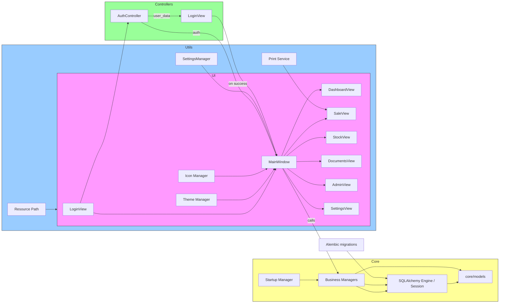

## Architecture du projet

Diagramme Mermaid représentant les composants principaux et le flux de données.

Notes:
- Le point d'entrée est `main.py` qui initialise la DB, le thème et la fenêtre de connexion.
- `MainWindow` orchestre les vues via un `QStackedWidget` et applique les permissions par rôle.
- La persistance utilise SQLAlchemy avec une base SQLite (migrations via Alembic).

Vous pouvez rendre ce diagramme visible dans un viewer markdown qui supporte Mermaid, ou l'exporter en PNG/SVG via un outil externe.
